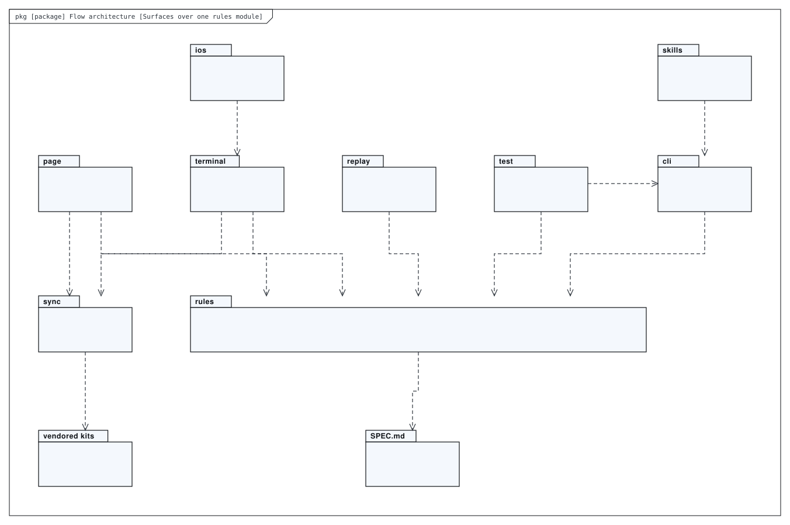
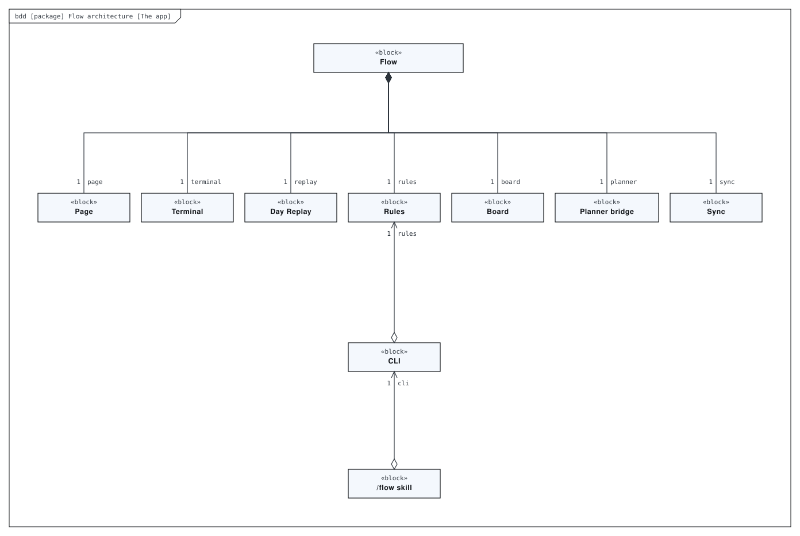
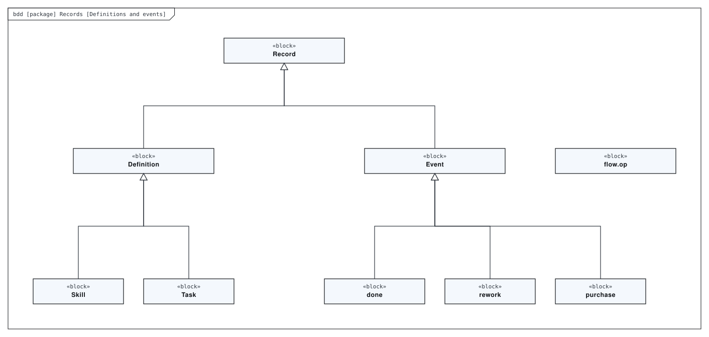
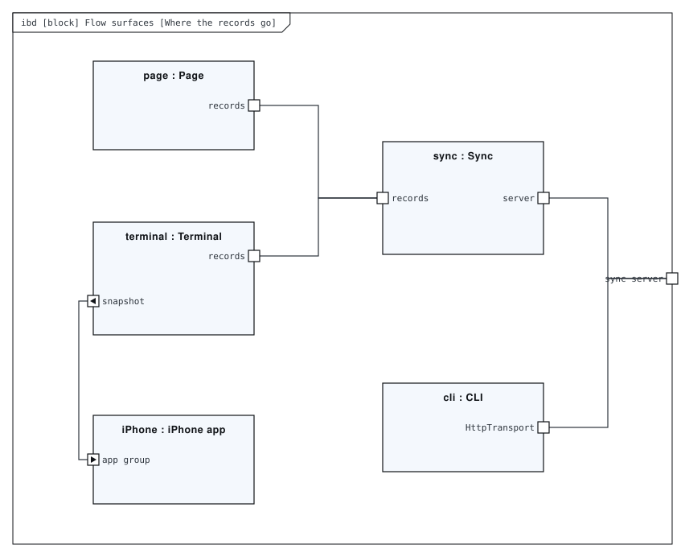
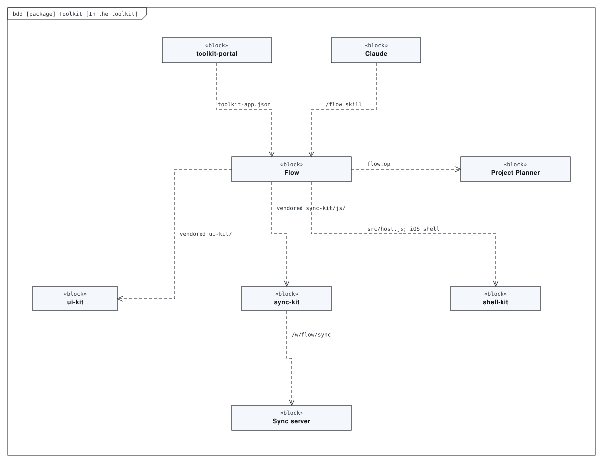
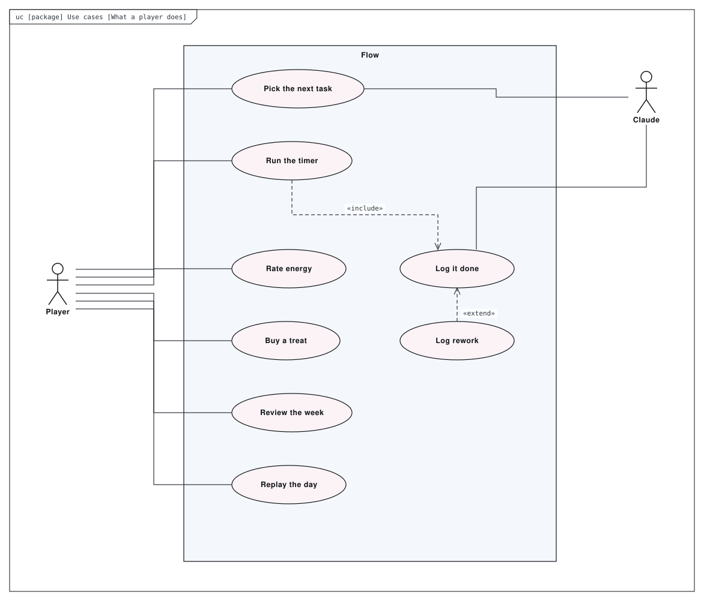
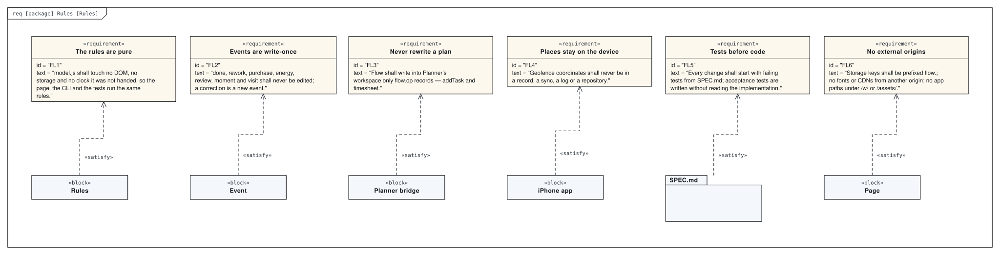

# Architecture

Work and life as a game of getting faster and better: skills that level up, targets that stay just ahead of you, points for treats, rework that costs, and a 90s-style replay of your day. Every surface runs one pure rules module, `src/model.js`: the page (HUD or handheld look), the iPhone terminal, the replay, and the CLI behind the `/flow` skill. Records live in workspace `flow`. Definitions are last-write-wins and events are write-once. Flow reads Project Planner’s plans but writes back only `flow.op` operations. `SPEC.md` is the product, and tests come before code.

This directory holds a SysML model of the repository, made with [SysML Modeler](https://github.com/allenxhsu/sysml-modeler).
`architecture.sysml.json` is the source: open it with **File ▸ Open** in the modeler to edit it, and re-export the SVGs from there.
The SVGs below are exports of it. The model passes the modeler's checks with 0 errors and 0 warnings.

## Surfaces over one rules module

*Package diagram* of **Flow architecture**.

## The app

*Block definition diagram* of **Flow architecture**.

## Definitions and events

*Block definition diagram* of **Records**. Definitions are last-write-wins; events are write-once.

## Where the records go

*Internal block diagram* of **Flow surfaces**. Everything that runs the rules.

## In the toolkit

*Block definition diagram* of **Toolkit**.

## What a player does

*Use case diagram* of **Use cases**.

## Rules

*Requirement diagram* of **Rules**.

## Generated views

Computed from the model each time it is opened in the modeler:

- **Rules, as a table** — requirement table
- **What verifies which rule** — dependency matrix
